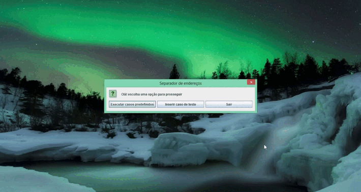

<h1 align = "center">Separador de Endereços - Projeto PwC </h1>

# Sobre
Um programa que separa o endereço fornecido em nome e número da rua. Contém alguns casos de teste para execução automática.

Esse projeto foi desenvolvido como teste de programação da empresa PwC. Dentre suas funcionalidades estão:

- Separação de endereços simples (Um nome e número da rua).
- Separação de endereços compostos (Múltiplos nomes e um número da rua).
- Separação de endereços com nome e número composto (Múltiplos nomes e número da rua com complemento).
- Separação de endereços internacionais (Número seguido do nome da rua).
- Separação de endereços internacionais (Nome da rua e número com prefixo "No").
- Separação de endereços internacionais (Nome da rua como numeral e nome da rua)
- Normalização de endereços (Remoção de vírgulas do endereço de entrada) 

Observação: Nem todos os recursos podem estar implementados e/ou funcionando corretamente. Para verificar quais são as funcionalidades implementadas consulte a guia "[Funcionalidades](#Funcionalidades)", mais abaixo.

# Índice

* [Sobre](#sobre)
* [Índice](#indice)
* [Funcionalidades](#funcionalidades)
* [Demonstração](#demonstracao)
* [Pré Requisitos](#pre-requisitos)
    * [Hardware](#hardware)
    * [Software](#software)
    * [Outros](#outros)
* [Sobre o código](#sobre-o-código)
* [Tecnologias](#tecnologias)
* [Autor](#autor)

# Funcionalidades

- [x] Separação de endereços simples (Um nome e número da rua).
- [x] Separação de endereços compostos (Múltiplos nomes e um número da rua).
- [x] Separação de endereços com nome e número composto (Múltiplos nomes e número da rua com complemento).
- [x] Separação de endereços internacionais (Número seguido do nome da rua).
- [x] Separação de endereços internacionais (Nome da rua e número com prefixo "No").
- [x] Separação de endereços internacionais (Nome da rua como numeral e nome da rua)
- [x] Normalização de endereços (Remoção de vírgulas do endereço de entrada)

# Demonstração

# Pré Requisitos

#### Software
- IntelliJ IDE (ou outra IDE para manipular projetos em Java, como o NetBeans ou o Eclipse).
- Java JDK 18.0.2 (No caso do IntelliJ, pode ser baixado pelo próprio programa).

# Sobre o código
O código contém um menu simples elaborado com os elementos do JOptionPane e que redirecionam o fluxo do programa para duas funções, dependendo da escolha do menu. São elas:
- a função `casosTeste`: Ela atribui alguns casos de teste padrão a um array de strings e realiza a separação e exibição dos endereços.
- a função `inserirCaso`: Ela gera uma tela que permite que o usuário insira o endereço completo manualmente, realizando a separação e exibição do resultado posteriormente.

Ambas as funções redirecionam novamente o fluxo para uma terceira função, a `separadorEndereco`, que fica responsável pela aplicação do procedimento de normalização dos dados, separação de todos os elementos (palavras, números e ocasionais letras de complemento) do endereço, reorganizando-os de acordo com alguns critérios (vide "[Funcionalidades](#Funcionalidades)") e retornando o resultado em um array de strings para utilização pelas funções `casosTeste` e `inserirCaso`.
Observação: A função consegue realizar a separação desde endereços mais simples (Um nome e numeral da rua), passando pelos mais complexos (Múltiplos nomes e numeral da rua com complemento) até alguns padrões de endereços internacionais (Nomes de ruas envolvendo numerais, número da rua inserido antes do nome e mesmo números da rua com algum prefixo).

# Tecnologias
- [IntelliJ IDEA Community Edition](https://www.jetbrains.com/idea/)

# Autor
### Johann Herrero Cavadas

